# 📱 ServLocate App – Full Documentation

## Overview
ServLocate is an on-demand services platform built using Flutter and Firebase, integrated with CometChat UIKit for real-time messaging. It enables users to post, explore, book, and manage service requests across various categories like teaching, healthcare, cleaning, tech support, and more. Both clients and service providers operate from a single account, switching roles dynamically. It is ideal for Freelancers to post their services and the user friendly dashboard makes it easy for clients to discover and avail required services.

---
## ✅ Core Functionalities
* ***User Login*** via UID (CometChat)
* ***Service Posting*** with optional image upload
* ***Service Browsing & Filtering*** by category
* ***Booking Services*** with real-time updates
* ***Service Provider Dashboard*** to accept/reject bookings
* ***Booking History*** View for clients
* ***Real-time Chat*** using CometChat UIKit
* ***Mock Payment Screen*** (placeholder for real payment gateway)

---
## ⚙️ Features
### 👤 User Roles
* A single user can both post services as a provider and book services as a client.
* Role-based behavior is determined dynamically at runtime depending on user action.

### 🔐 Authentication
* Simple UID-based login via CometChat.
* No separate Firebase Authentication screen.
* Secure CometChat login is triggered using the UID.

### 🧭 Main Navigation Tabs
| Tab         | Description                                  |
| ----------- | -------------------------------------------- |
| Explore     | View and book available services             |
| My Bookings | Track client's bookings and complete them    |
| Post        | Add a new service with optional image upload |
| Inbox       | View & chat with matched providers/clients   |
| Profile     | View UID and logout option                   |

### 📄 Service Posting
* Users can post services with:
    * Title, description, category, location, price
    * Optional image (uploaded to Firebase Storage)
* All service listings are stored in Cloud Firestore.

### 🔍 Service Explorer
* Users can browse all available services.
* Category-based filtering supported.
* Clicking a service opens a detailed view.
* Bookings are stored with status: `pending`, `accepted`, `rejected`, `completed`

### 💼 Booking Workflow
#### For Clients:
* View your active, pending, and completed bookings
* Once accepted, chat with the provider
* After service completion, click ***"Mark as Completed"***
* Redirected to ***Mock Payment Portal***
* On successful payment:
    * Booking marked as `paid: true` and `status: completed`
    * Provider view is updated
#### For Providers:
* View incoming booking requests (`status: pending`)
* Accept or reject requests
* Accepted bookings shown separately
* Once paid and completed, they are removed from active view

### 💳 Mock Payment Screen
* Clients input card details (simulated) and press "Pay Now".
* The booking document’s paid field is set to true upon payment.
* This moves the booking from “Active” to “Completed” status.

### 💬 Real-Time Chat via CometChat
* Uses CometChatUIKit.
* Inbox page shows chat list.
* Direct Message opens with provider after booking is accepted.
* DM automatically initiated after booking acceptance.

---
## 🔧 Tech Stack
| Layer            | Technology                          |
| ---------------- | ----------------------------------- |
| Frontend         | Flutter (Dart)                      |
| State Management | Stateful Widgets                    |
| Backend          | Firebase (Firestore, Storage, Auth) |
| Realtime Chat    | CometChat UIKit                     |
| Image Handling   | image\_picker + Firebase Storage    |
| Authentication   | UID-based (via CometChat login)     |

---
## 📁 Project Structure
```
lib/
├── main.dart
├── firebase_options.dart
├── models/
│   └── service_model.dart
├── screens/
│   ├── bookings/
│   │   ├── booking_history_screen.dart
│   │   ├── provider_booking_requests_screen.dart
│   │   └── provider_accepted_bookings_screen.dart
│   ├── services/
│   │   ├── post_service_screen.dart
│   │   ├── service_explorer_screen.dart
│   │   └── service_details_screen.dart
│   ├── login_screen.dart
│   ├── profile_screen.dart
│   ├── inbox_screen.dart
│   ├── splash_screen.dart
│   ├── main_navigation_screen.dart
│   └── mock_payment_screen.dart
```

---
## 🧩 Dependencies
Add these to your `pubspec.yaml`:
```
dependencies:
  flutter:
    sdk: flutter
  cupertino_icons: ^1.0.8
  cometchat_chat_uikit: ^4.0.0
  firebase_core: ^2.24.2
  firebase_auth: ^4.16.0
  firebase_storage: ^11.6.0
  image_picker: ^1.0.7
  uuid: ^4.3.3
  google_fonts: ^6.2.1
  cloud_firestore: ^4.15.0
```

---
## 🌳 Development Environment
* ***Flutter SDK***: 3.x+
* ***Dart SDK***: Compatible with null safety
* ***Firebase***: Firestore & Storage
* ***CometChat***: Flutter Chat UIKit
* ***IDE***: VSCode & Android Studio
* ***Testing Device***: Google Pixel 2 emulator + physical Android phones

---
## 🔥 Firebase Setup
* Authentication: No Firebase Auth used. Login handled via CometChat UID.
* Firestore Collections:
   * `services`: Posted service listings
   * `bookings`: Tracks service booking between client and provider
* Firebase Storage: Stores optional service images

---
## 📱 Supported Platforms
| Platform | Supported              |
| -------- | ---------------------- |
| Android  | ✅ Fully tested        |
| iOS      | ⚠️ Needs configuration |
>This app uses CometChat UIKit and Firebase which are both iOS compatible, but iOS build and testing has not been done yet.

---
## 🚀 Setup Instructions
1. Flutter Setup:
    ```
    flutter pub get
    ```
2. Firebase Setup:
    * Add your Android app to Firebase.
    * Download `google-services.json` and place it under `android/app/`.
3. NDK Fix (in `android/app/build.gradle.kts`):
    ```
    android {
      ndkVersion = "27.0.12077973"
      ...
    }
    ```
4. CometChat Setup:
    * Register at CometChat.
    * Replace `your_app_id`, `region`, and `auth_key` in your CometChat initialization.
5. Run the App:
    ```
    flutter run
    ```
6. Build APK for Release:
  ```
  flutter build apk --release
  ```

---
## 📲 User Flow
**Login**
* Users enter their UID to login (via CometChat).
* On successful login, users are redirected to `MainNavigationScreen`.
  
**Post a Service**
* Providers fill a form: title, description, price, location, category.
* Image upload is optional (stored in Firebase Storage).
* On submit, data is stored in Firestore.
  
**Browse & Book Services**
* Users can browse services in the `ServiceExplorerScreen`.
* Filtering by category is available.
* Clicking “Book Now” sends a booking request with:
   * `status: "pending"`
   * `paid: false` (default)
* Booking data is added to the `bookings` Firestore collection.
  
**Booking Requests (Provider Side)**
* Providers view incoming requests (`provider_booking_requests_screen.dart`).
* Each request has options to:
   * ✅ Accept → Sets `status: "accepted"` and `paid: false`
   * ❌ Reject → Sets `status: "rejected"`
* Accepted bookings appear in a separate section.

**Accepted Bookings (Provider Side)**
* All active bookings accepted by the provider are shown here(`provider_accepted_bookings_screen.dart`).
* The provider can:
   * View booking details.
   * Open chat with the respective client.
   * Automatically see bookings disappear once marked `paid`.

**Booking History (Client Side)**
* Clients see their booking requests on `BookingHistoryScreen`.
* Bookings marked as `accepted` and `paid: false` can be:
   * Marked as “Completed” by the client.
   * This redirects them to `MockPaymentScreen`.

**Mock Payment Flow**
* Client clicks "Mark as Complete".
* Redirected to a mock payment page (`MockPaymentScreen`).
* On successful payment:
   * Booking's `paid` status is updated to `true`.
   * It is removed from active lists.
   * Provider can now consider the service completed.

**Chat Integration (Real-Time)**
* Powered by CometChat UIKit.
* Triggered only when a booking is accepted.
* Both provider and client can:
   * Access chat via Inbox (`InboxScreen`) or via specific booking.
   * Directly open a DM with the other party.
* Back navigation from chat is now safe and functional.

---
## 🧪 Testing Checklist
| Feature                            | Tested |
| ---------------------------------- | ------ |
| UID Login                          | ✅      |
| Post Service (with/without image)  | ✅      |
| View & Filter Services             | ✅      |
| Book Service                       | ✅      |
| View Bookings (Client)             | ✅      |
| Accept/Reject Bookings (Provider)  | ✅      |
| Chat Interface Opens               | ✅      |
| Mock Payment Screen                | ✅      |
| Message Notification on Acceptance | ⚠️      |

---
## 💬 Notes
* **Image Upload Optional:** Posting works even if no image is uploaded.
* **Mock Payment:** `mock_payment_screen.dart` can be replaced or enhanced for Razorpay/Stripe.
* **CometChat UID Login:** No Firebase Auth used—login is based on CometChat UID.
* **Return Icon Bug from Inbox:** In the `InboxScreen` there is a return icon on the top left corner from the CometChat UI Kit. Clicking it causes the device screen to blackout and the app to stop working, needing to restart the app.
* **Stay Logged-in:** This feature is not available yet. Every time the app is restarted, Login Credentials are required.

---
## 📌 Future Enhancements
* Add a sign-up option in login page for new users
* Integrate real payment gateway
* Add status update and message notifications
* Provider profile management
* Scheduling Booking Date & Time (Integrating Google Calendar)
* Rating/review system for services
* Analytics dashboard for service usage

---
## 📷 Screenshots
> Screenshots of key flows:
* Splash Screen / Welcome Screen
  
  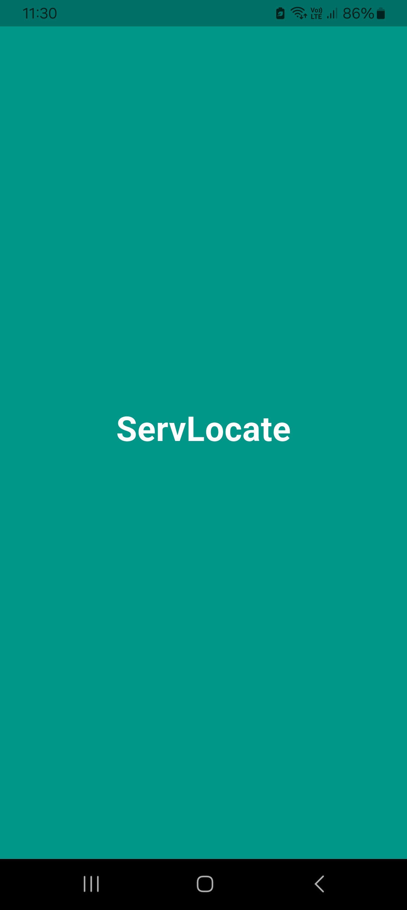
* Login Screen:
  
  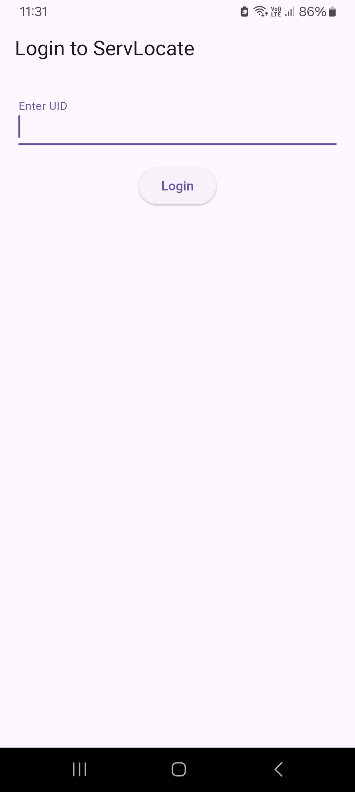
* Home Screen / Explore Services Screen:

  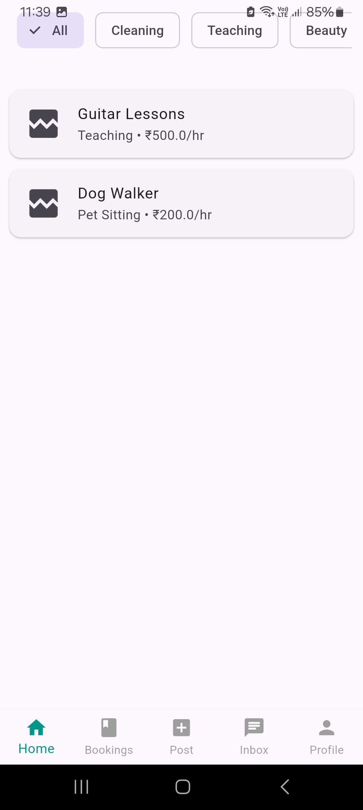
* Service Details (Click on each service to view details in Home Screen):

  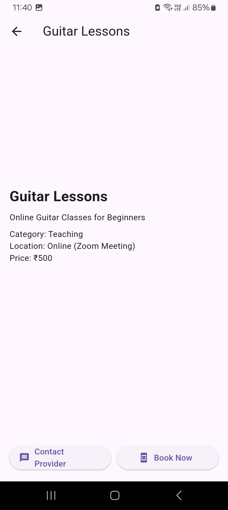
  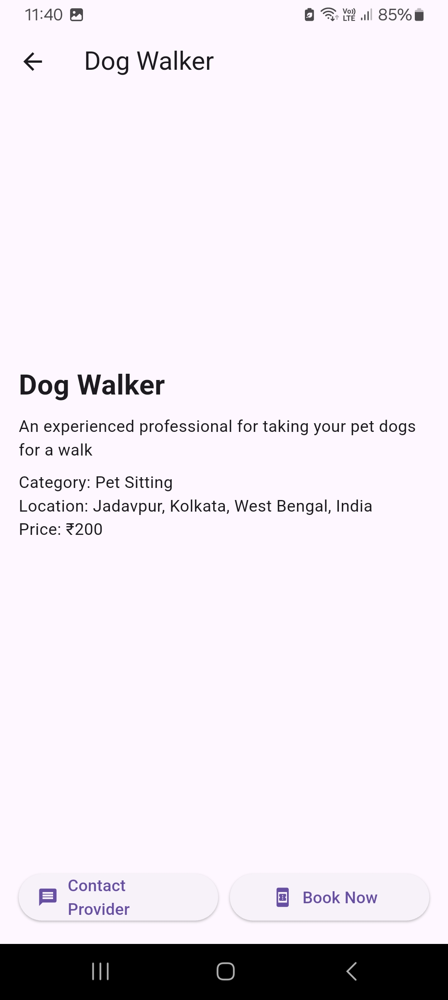
* User Profile Screen:

  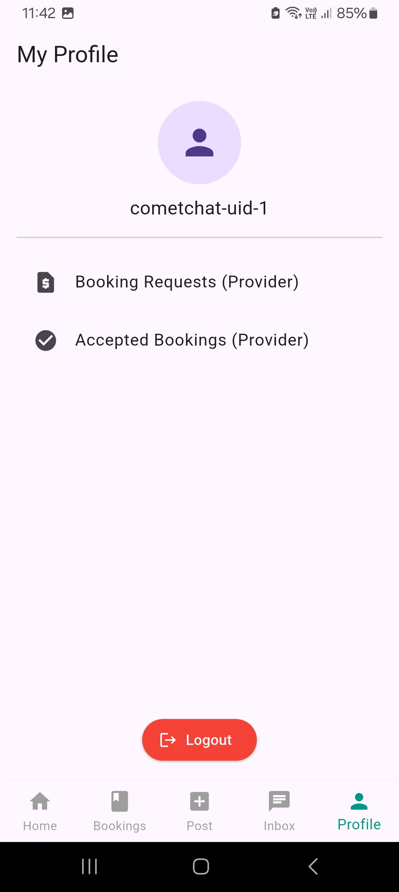
* Post Service Screen (For Providers):

  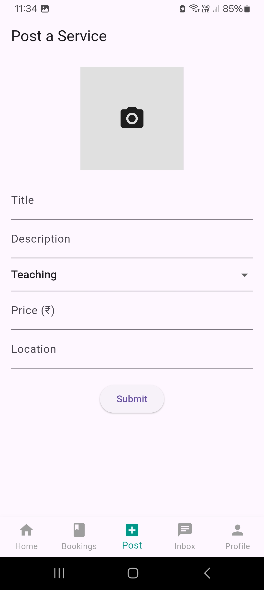
* Pending Booking Request Screen (For Providers):

  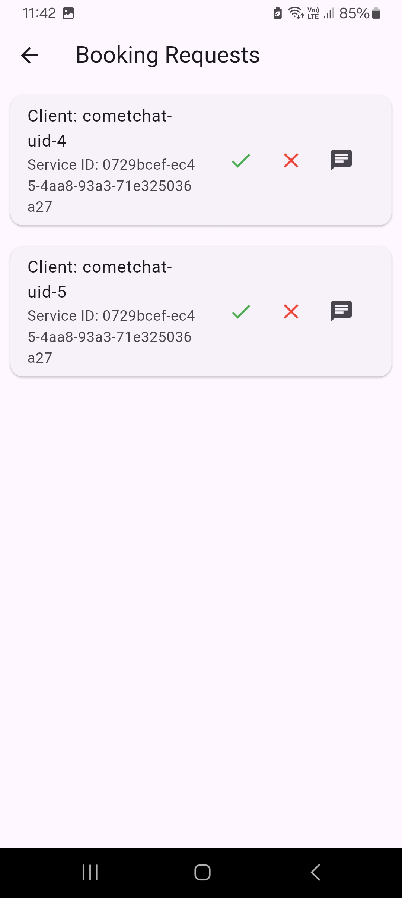
* Active Accepted Bookings Screen (For Providers):

  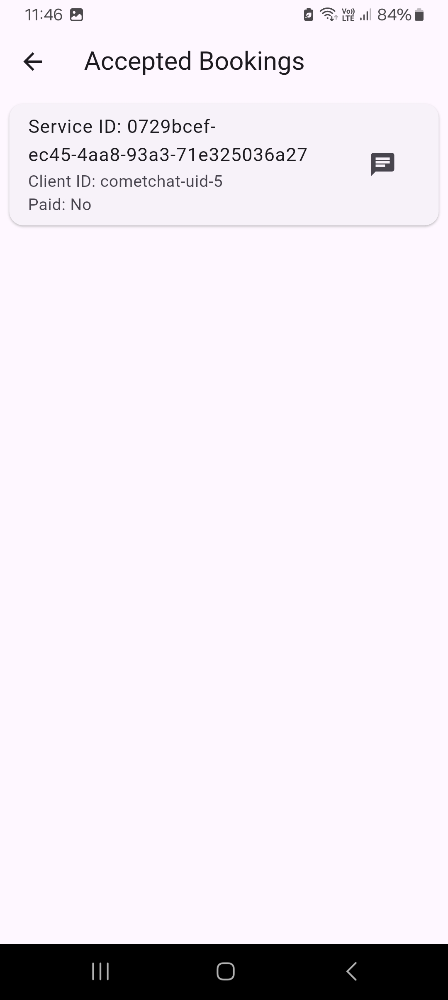
* Booking History Screen (For Clients):

  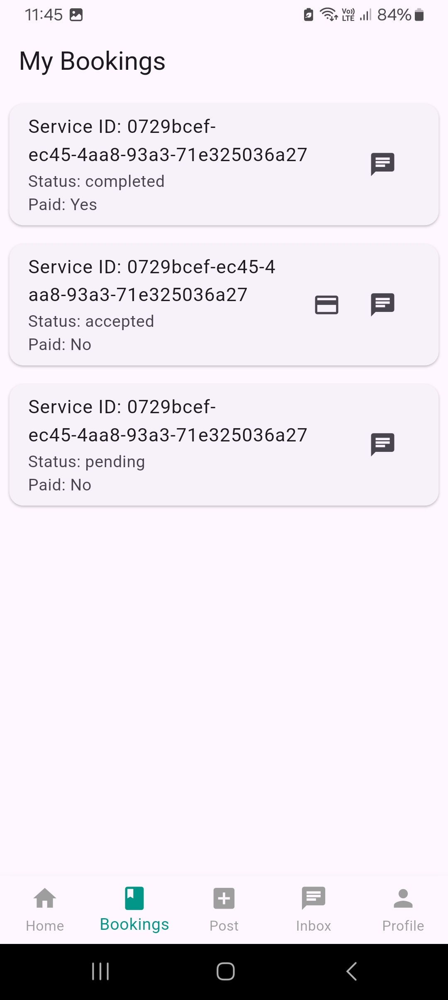
* Payment Portal (For Clients):

  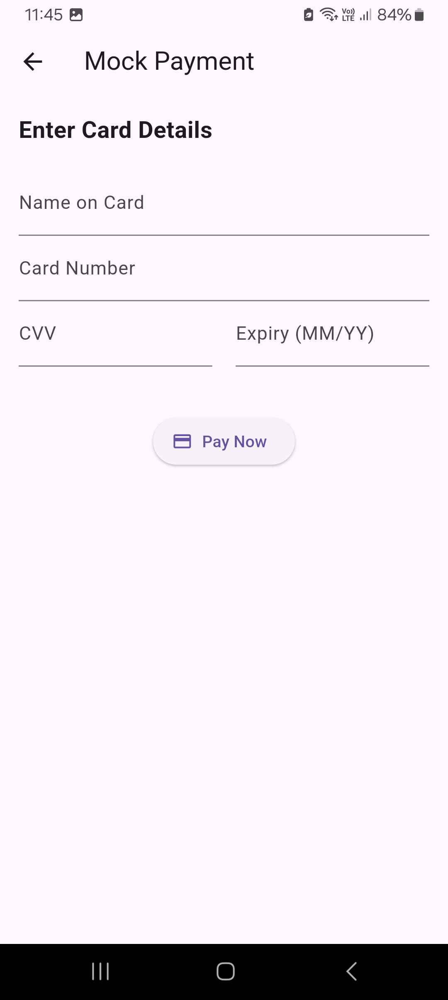
* Chat Inbox (CometChat UI):

  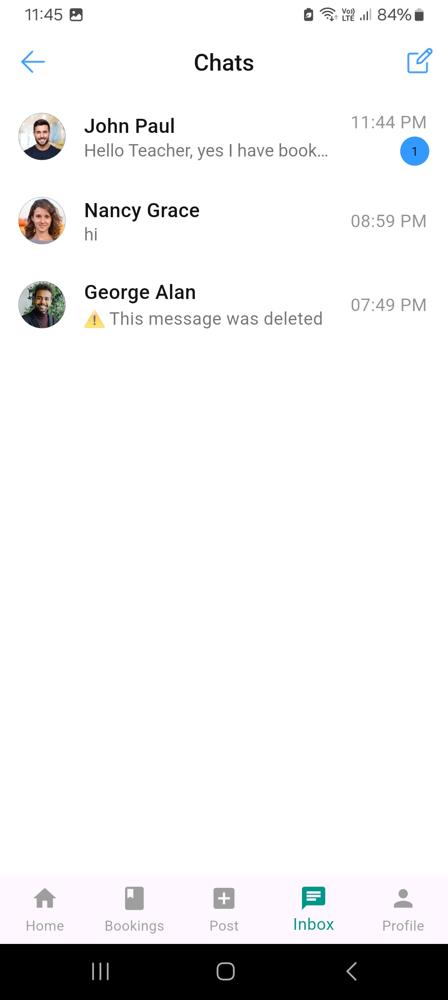
  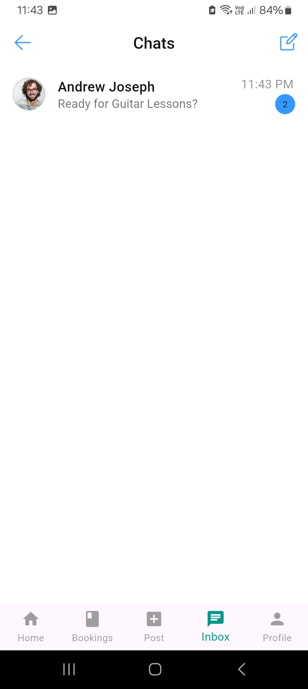
* Chat Interface (CometChat UI):

  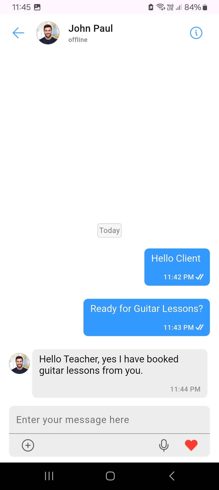
  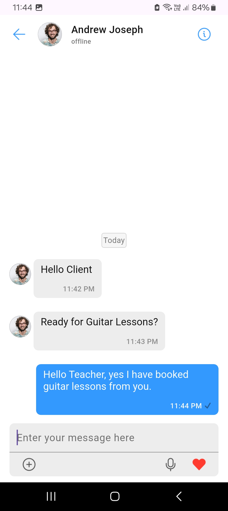
